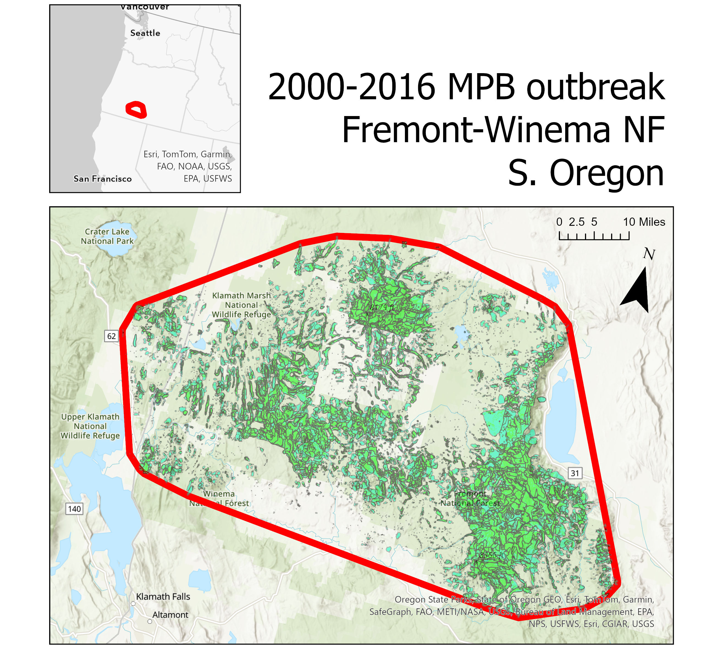

```{r setup, include=FALSE}
knitr::opts_chunk$set(echo = TRUE,
                      warning = FALSE,
                      prompt = FALSE,
                      error = TRUE,
                      message = FALSE,
                      cache = FALSE,
                      cache.lazy = FALSE,
                      eval = TRUE,
                      eval.after = "fig.cap")
# knitr::opts_knit$set(base.dir = "C:/Users/DanielPerret/Box/01. daniel.perret Workspace/PROJECTS/plots-planes-pixels/")

library(tidyverse)
library(rFIA)
library(ggplot2)
library(ggExtra)
library(rgdal)
library(sp)
library(ggsci)
library(raster)
library(splines)
library(lme4)
library(brms)
library(patchwork)
library(performance)
library(ggeffects)
select <- dplyr::select

# setting my preferred ggplot2 theme
theme_set(theme_bw())
theme_update(text = element_text(size=16, color = "black"),
             panel.grid.major = element_blank(),
             panel.grid.minor = element_blank(),
             strip.background = element_blank(),
             panel.border=element_rect(size=1.5))

# colors to be used in all map figures
mapcolor <- "wheat3"
linecolor <- "gray40"

getwd()
# sourcing estimation base code
source("/Users/DanielPerret/Box/01. daniel.perret Workspace/PROJECTS/plots-planes-pixels/code/growMort_rewrite_METRIC.R")
```

# Plots, planes, pixels

## Mountain pine beetle case study

For this case study, we're looking for an area of insect mortality that is easy to detect in all three datasets -- FIA, ADS, and RS. Danny suggested this area northeast of Klamath Falls as an extensive mountain pine beetle outbreak that caused extensive mortality over more than a decade.

From Danny:

"It started in the early 2000s slightly southwest of Summer lake. Then continued to grow over time and move east ward. The eastern damage more on the Winema happened a bit later and is in full force 2010 and slowly winds down until about 2016 ish. The snip below may help you focus on the area as you pull in the layers of ADS data. It would be interesting to me to see how valid the ADS data is over that time compared to what FIA and imagery finds. I would assume that again ADS data keeps calling the same dead trees recent mortality for longer than what actually happened, but maybe not? Just seems wild how long that outbreak took to eat them selves out of house and home."


This is the approximate footprint that Danny gave us. I pulled all ADS data from the years 2000-2016 from the area, and grabbed all polygons that were attributed to mountain pine beetle (DCA_CODE == 11006). This yielded \~14,500 polygons covering roughly 700,000 ha:



## Setup code {.tabset}

### ADS data

```{r}

# WGS84
old.proj <- "+proj=longlat +ellps=WGS84 +datum=WGS84 +no_defs"

# Albers Equal Area; centered in western US
base.proj <- "+proj=aea +lat_0=23 +lon_0=-96 +lat_1=29.5 +lat_2=45.5 +x_0=0 +y_0=0 +datum=NAD83 +units=m +no_defs"

mpb.fp <- readOGR(dsn="/Users/DanielPerret/Box/01. daniel.perret Workspace/PROJECTS/plots-planes-pixels/data/ADS_data/shapefiles/",
                  layer = "mpb_allyears_fp",
                  verbose=F) %>% 
  spTransform(.,
              CRSobj = CRS(base.proj))

mpb.all <- readOGR(dsn="/Users/DanielPerret/Box/01. daniel.perret Workspace/PROJECTS/plots-planes-pixels/data/ADS_data/shapefiles/",
                   layer = "MPB_casestudy_2000_2016",
                   verbose=F) %>% 
  spTransform(.,
              CRSobj = CRS(base.proj)) %>% 
  sf::st_as_sf()

```

### FIA data

```{r fia.data, echo=T}

# reading downloaded FIA data from a local directory, using rFIA functionality

fia <- readFIA(dir = "/Users/DanielPerret/Box/01. daniel.perret Workspace/PROJECTS/plots-planes-pixels/data/FIA/",
               common=T, states=c("OR"))

fia <- readFIA(dir = "/Users/DanielPerret/Box/01. daniel.perret Workspace/fia_data_082123/",
               common=T, states=c("OR"))

exact.coords <- read.csv("D:/coords_format.csv",header=T) %>% 
  select(PLT_CN = ID1,
         LAT_EXACT = lat,
         LON_EXACT = long)

#creating some fields in various tables

fia$PLOT <- fia$PLOT %>% 
  mutate(pltID = paste(UNITCD,STATECD,COUNTYCD,PLOT,sep="_"),
         PLT_CN = CN,
         ECOSUBCD = trimws(ECOSUBCD)) %>% 
  group_by(pltID) %>% 
  mutate(most.recent = ifelse(MEASYEAR==max(MEASYEAR),
                              "yes","no")) %>% 
  ungroup() %>% 
  left_join(exact.coords,
            by="PLT_CN")

fia$COND <- fia$COND %>% 
  left_join(fia$PLOT %>% 
              select(PLT_CN,most.recent),
            by="PLT_CN")

# Because annual inventories began later in Wyoming, we need to link back to earlier period inventories in order to make our eventual change estimates. This code does that by using plot number links and tree azimuth and distance. 

# Other data curation steps

## creating some fields and updating all SPCDs to most-recently ID'd SPCD -- this is necessary because it's quite common for trees to change species ID, especially in smaller age classes.

fia$TREE <- fia$TREE %>% 
  left_join(fia$PLOT %>% 
              select(PLT_CN,most.recent),
            by="PLT_CN") %>% 
  mutate(TRE_CN = CN,
         DIA = DIA*2.54,
         PREVDIA = PREVDIA*2.54,
         agent_key = case_when(STATUSCD==2 & AGENTCD %in% c(00,70) ~ "unknown1",
                               STATUSCD==2 & AGENTCD == 10 ~ "insect",
                               STATUSCD==2 & AGENTCD == 20 ~ "disease",
                               STATUSCD==2 & AGENTCD == 30 ~ "fire",
                               STATUSCD==2 & AGENTCD == 40 ~ "animal",
                               STATUSCD==2 & AGENTCD == 50 ~ "weather",
                               STATUSCD==2 & AGENTCD == 60 ~ "competition",
                               STATUSCD==2 & AGENTCD == 80 ~ "land use",
                               STATUSCD==2 & is.na(AGENTCD) & 
                                 (PREV_STATUS_CD==1 | 
                                    is.na(PREV_STATUS_CD)) ~ "unknown2"),
         insect.damage = case_when(DAMAGE_AGENT_CD1 >= 10000 &
                                     DAMAGE_AGENT_CD1 < 19000 ~ 1,
                                   DAMAGE_AGENT_CD2 >= 10000 &
                                     DAMAGE_AGENT_CD2 < 19000 ~ 1,
                                   DAMAGE_AGENT_CD3 >= 10000 &
                                     DAMAGE_AGENT_CD3 < 19000 ~ 1,
                                   TRUE ~ 0),
         disease.damage = case_when(DAMAGE_AGENT_CD1 >= 20000 &
                                      DAMAGE_AGENT_CD1 < 30000 ~ 1,
                                    DAMAGE_AGENT_CD2 >= 20000 &
                                      DAMAGE_AGENT_CD2 < 30000 ~ 1,
                                    DAMAGE_AGENT_CD3 >= 20000 &
                                      DAMAGE_AGENT_CD3 < 30000 ~ 1,
                                    TRUE ~ 0),
         other.damage = case_when(DAMAGE_AGENT_CD1 > 30000 ~ 1,
                                  DAMAGE_AGENT_CD2 > 30000 ~ 1,
                                  DAMAGE_AGENT_CD3 > 30000 ~ 1,
                                  TRUE ~ 0)) %>% 
  left_join(.,
            fia$TREE %>% 
              select(PREV_TRE_CN, SPCD) %>% 
              rename(LATER_SPCD=SPCD),
            by=c("TRE_CN"="PREV_TRE_CN")) %>% 
  mutate(SPCD = case_when(SPCD!=LATER_SPCD & !is.na(LATER_SPCD) ~ LATER_SPCD,
                          is.na(LATER_SPCD) ~ SPCD,
                          TRUE ~ SPCD)) %>% 
  left_join(.,
            fia$PLOT %>% 
              select(PLT_CN, MEASYEAR),
            by="PLT_CN")

spcd.ref <- read.csv("/Users/DanielPerret/Box/01. daniel.perret Workspace/FIADB_REFERENCE/REF_SPECIES.csv")

fia$TREE <- fia$TREE %>% 
  left_join(., spcd.ref %>% select(SPCD,COMMON_NAME))
```

### Other spatial

```{r}

# North American continent
cont <- readOGR(dsn="/Users/DanielPerret/Box/01. daniel.perret Workspace/base_spatialdata/continents",
                layer = "na",
                verbose=F,
                p4s = old.proj) %>% 
  spTransform(.,
              CRSobj = CRS(base.proj))

# Level 4 ecoregions (i.e., ecoregion subsections)
er4 <- readOGR(dsn="/Users/DanielPerret/Box/01. daniel.perret Workspace/base_spatialdata/cleland_usfs_ecoregions",
               layer = "S_USA.EcomapSubsections",
               verbose=F) %>% 
  spTransform(.,
              CRSobj = CRS(base.proj))

# Level 3 ecoregions (i.e., ecoregion sections)
er3 <- readOGR(dsn="/Users/DanielPerret/Box/01. daniel.perret Workspace/base_spatialdata/cleland_usfs_ecoregions",
               layer = "S_USA.EcomapSections",
               verbose=F) %>% 
  spTransform(.,
              CRSobj = CRS(base.proj))

# Level 2 ecoregions (i.e., ecological provinces)
er2 <- readOGR(dsn="/Users/DanielPerret/Box/01. daniel.perret Workspace/base_spatialdata/cleland_usfs_ecoregions",
               layer = "S_USA.EcoMapProvinces",
               verbose=F) %>% 
  spTransform(.,
              CRSobj = CRS(base.proj))

```

## Initial analyses and exploration

### Area impacted timeseries {.tabset}

This is a good initial point of attack, as it reflects multiple aspects of the datasets that we're looking to compare, i.e., spatial and temporal resolutions.

#### total

```{r}

mpb.all %>% 
  sf::st_drop_geometry() %>% 
  group_by(SURVEY_YEA) %>% 
  summarise(area = sum(ACRES)) %>% 
  ggplot(.,aes(x = SURVEY_YEA,
               y = area)) +
  geom_line(lwd=2) +
  labs(x = "Year",
       y = "Acres of damage")


```

#### by host

```{r}

mpb.all %>% 
  sf::st_drop_geometry() %>% 
  group_by(SURVEY_YEA,HOST) %>% 
  summarise(area = sum(ACRES)) %>% 
  ggplot(.,aes(x = SURVEY_YEA,
               y = area,
               col = HOST)) +
  geom_line(lwd=2) +
  labs(x = "Year",
       y = "Acres of damage")


```

## Bringing in FIA data

There were a total of 1340 plots measured within the MPB footprint between 1998 and 2019. I'm using a longer time period here than the ADS data because of the FIA remeasurement period.

Here are some basic summary statistics about the region:

```{r}

summary <- growMort_dlp.metric(db = fia,
                            grpBy = COMMON_NAME,
                            polys = mpb.fp,
                            sizeThresh = 2.54,
                            evals = c(41903,411903),
                            totals = T) %>% 
  filter(YEAR == 2019)

knitr::kable(summary %>% 
               arrange(CURR_TPH*-1) %>% 
               select(COMMON_NAME, MORT_TPH, MORT_PERC, CHNG_PERC),
             digits=2)
```

So across all species in the region, by far the most mortality was in lodgepole and ponderosa, followed by white fir. 

```{r}


by.agent <- growMort_dlp.metric(db = fia,
                            grpBy = c(COMMON_NAME,agent_key),
                            #treeDomain = COMMON_NAME %in% c("lodgepole pine","ponderosa pine","white fir", "sugar pine"),
                            polys = mpb.fp,
                            sizeThresh = 12.7,
                            evals = c(41903,411903),
                            totals = T) %>% 
  filter(YEAR == 2019)


by.agent %>% 
  mutate(agent_key = ifelse(agent_key %in% c("unknown1","unknown2"),"unknown",agent_key)) %>% 
  group_by(COMMON_NAME) %>% 
  mutate(perc.mort = PREV_TOTAL/sum(PREV_TOTAL)) %>% 
  ggplot(.,
         aes(x = COMMON_NAME,
             y = perc.mort)) + 
  geom_col(aes(fill = agent_key), col = "black") +
  scale_fill_jama(name = "Agent") +
  theme(axis.text.x = element_text(angle = 45,hjust = 1)) +
  labs(x = "", y = "Proportion of total mortality")

```

Okay, so we do see that insects are one of the dominant mortality sources, especially for the pines -- interesting that land use is such a large mortality source for ponderosa, though. Disease (WPBR?) for sugar pine.

There's a hitch here, though. ADS data shows that the MPB outbreak starts in ~2005 -- however, we see something different if we look at mortality agents each year. Focusing on insect mortality, for example...

```{r}

insect.yr <- growMort_dlp.metric(db = fia,
                                 grpBy = c(MEASYEAR,AGENTCD),
                                 #treeDomain = agent_key=="insect",
                                 polys = mpb.fp,
                                 sizeThresh = 2.54,
                                 evals = c(41903, 411903),
                                 totals=T) %>% 
  filter(AGENTCD==10)


rFIA::tpa(db = fia,
                       grpBy = c(MEASYEAR,AGENTCD),
                       treeType = "all",
                       
                       polys=mpb.fp) %>% 
  filter(AGENTCD==10) %>% 
  group_by(MEASYEAR) %>% 
  filter(YEAR == max(YEAR)) %>% 
  select(MEASYEAR,TPA, TPA_SE) %>% 
  bind_rows(data.frame(MEASYEAR = c(2000:2005,2007,2008,2010),
                       TPA = 0,
                       TPA_SE = 0)) %>% 
  ggplot(.,
         aes(x = MEASYEAR,
             y = TPA)) +
  geom_line(lwd=2) +
  labs(x = "Year",
       y = "Insect mortality (tpa)",
       title = "Mortality estimates, FIA \n(individual AGENTCD)")
  
```

So, why don't we pick up the start of the outbreak in 2005? Turns out that AGENTCDs were only assigned to *new* mortality trees -- i.e., those that had been remeasured. We have a little bit of mortality observed in 2006 and 2009 above... that comes from two plots that were remeasured 5 years after initial measurement. So the huge spike we see in 2011 reflects FIA starting to pick up mortality that's already been going on for 5 years, according to ADS data. And we might see that mortality signal continuing to increase until 2026 or later -- a full remeasurement cycle after the outbreaks ends! Of course, this shouldn't be an issue for outbreaks that begin post-2011.

Disturbance condition classes offer one way to get around this... though of course, if we move away from tree-level information, we lose our ability to make good assessments of population-level impacts (e.g., proportional mortality). We can still estimate affected area, though. Let's do that now in two different ways:

1) Using AGENTCDs to define mortality area. This is the same approach as in the subalpine fir paper and spruce-fir manuscript.

2) Using DSTRBCDs at the condition  level -- digging in a bit showed that DSTRBCDs were assigned even during initial plot measurements, which hopefully means they'll pick up the start of the outbreak. 

## Mort agent codes {.tabset}

### timeseries

```{r}
# getting plot-level expansion factors by PLT_CN
popinfo <- rFIA::getDesignInfo(fia,mostRecent = F,type="ALL") %>%
  left_join(fia$POP_STRATUM %>% 
              select(STRATUM_CN=CN,
                     EXPNS),
            by="STRATUM_CN") %>% 
  group_by(PLT_CN) %>% 
  filter(YEAR == max(YEAR))

insect.plots <- fia$TREE %>% 
  filter(mpb==1,AGENTCD==10) %>% 
  pull(PLT_CN) %>% 
  unique()

## mortality area
fia$PLOT %>% 
  left_join(popinfo %>% 
              select(PLT_CN,EXPNS)) %>% 
  filter(mpb==1,
         PLT_CN %in% insect.plots) %>%
  group_by(MEASYEAR) %>% 
  summarise(area = sum(EXPNS,na.rm=T),
            count=n()) %>% 
  select(MEASYEAR, area) %>% 
  bind_rows(data.frame(MEASYEAR = c(2000:2005,2007,2008,2010), area = 0)) %>% 
  ggplot(.,aes(x=MEASYEAR,
               y=area)) +
  geom_line(lwd=2) +
  labs(x = "Year",
       y = "Area with insect mortality (ac)",
       title = "MPB impact area, FIA \n(individual AGENTCD)")

```
So, very temporal pattern as the TPA estimate. But check out how wildly different the area estimate is from ADS data... ADS indicates three times more area impacted than FIA data.


### maps

```{r}
ggplot() +
  geom_sf(data=mpb.fp %>% sf::st_as_sf(),
          fill = "lightgray")+
  geom_sf(data=mpb.all %>% 
            mutate(MEASYEAR = SURVEY_YEA),
          #aes(fill = factor(MEASYEAR),
            fill = "dodgerblue2",
          col = NA, alpha = 0.6) +
  geom_sf(data = in.mpb %>% sf::st_as_sf(),
          col = "black", alpha = 0.2) +
  geom_sf(data = in.mpb %>% sf::st_as_sf() %>% filter(PLT_CN%in%insect.plots),
          col = "red") +
  facet_wrap(facets=~MEASYEAR)

```

Here gray points are FIA plots measured in that year that don't have any insect AGENTCDs recorded... and red points are plots with AGENTCD==10 recorded at least once. We clearly see that AGENTCDs weren't recorded during initial plot measurements after the annualized design was implemented in 2001.

## Disturbance conditions {.tabset}

So most insect disturbance conditions are assigned a DSTRBYR = 9999, which indicates that the disturbance occurs continuously over a period of time. We're left with measurement year...

### timeseries
```{r}
dist.cond <- fia$COND %>% 
  filter(PLT_CN %in% mpb.plts,
         DSTRBCD1 %in% c(10:12)|
           DSTRBCD2 %in% c(10:12)|
           DSTRBCD3 %in% c(10:12)) %>% 
  mutate(DSTYR = case_when(DSTRBCD1 %in% c(10:12) ~ DSTRBYR1,
                           DSTRBCD2 %in% c(10:12) ~ DSTRBYR2,
                           DSTRBCD3 %in% c(10:12) ~ DSTRBYR3))

dist.plt <- dist.cond %>% 
  group_by(PLT_CN) %>% 
  summarise(DSTPROP = sum(CONDPROP_UNADJ))
  
  
## mortality area
fia$PLOT %>% 
  left_join(popinfo %>% 
              select(PLT_CN,EXPNS)) %>% 
  filter(mpb==1, PLT_CN %in% dist.plt$PLT_CN) %>%
  left_join(dist.plt, by = "PLT_CN") %>% 
  group_by(MEASYEAR) %>% 
  summarise(area = sum(EXPNS*DSTPROP,na.rm=T),
            count=n()) %>% 
  ggplot(.,aes(x=MEASYEAR,
               y=area)) +
  geom_line(lwd=2) +
  labs(x = "Year",
       y = "Insect disturbed area",
       title = "MPB impact area, FIA \n(Condition-level)")


```

So, we have slightly less area than with individual-level data, which makes sense as we're adjusting plot expansion factors for condition proportion. Interestingly, we don't see a clear spike in 2005/2006, like we do with ADS data. Pre-2005 insect disturbances could be on other hosts... I'm not really sure how to parse that out.

### map

```{r}
ggplot() +
  geom_sf(data=mpb.fp %>% sf::st_as_sf(),
          fill = "lightgray")+
  geom_sf(data=mpb.all %>% 
            mutate(MEASYEAR = SURVEY_YEA),
          #aes(fill = factor(MEASYEAR),
            fill = "dodgerblue2",
          col = NA, alpha = 0.6) +
  geom_sf(data = in.mpb %>% sf::st_as_sf(),
          col = "black", alpha = 0.2) +
  geom_sf(data = in.mpb %>% sf::st_as_sf() %>% filter(PLT_CN%in%dist.plt$PLT_CN),
          col = "red") +
  facet_wrap(facets=~MEASYEAR)

```

Here red points are plots with an insect disturbance condition -- we don't have the same problem re: initial annualized plot measurements. 

## Next up

This points to some additional complexities in the FIA data that I hadn't really anticipated. Getting the clearest signal for this MPB outbreak looks like it wil involve combining different aspects of the FIA data -- condition classes to pick up initial stages, damage codes (to do) for initial attribution, and individual data to get at effects.

To do next:

- dig into damage codes -> or break by FORTYPCD
- MORTYR for finding outbreak upswing; also %dead          
- break out ADS curve with mort severity
- calculate annual comission/omission rates for FIA vs ADS detection
- calculate ADS annual "new area" (i.e., symmetric difference) to see how well that matches FIA estimate (gets at Danny's concern about recounting old damage)

- with HZ: get spectral timeseries started


